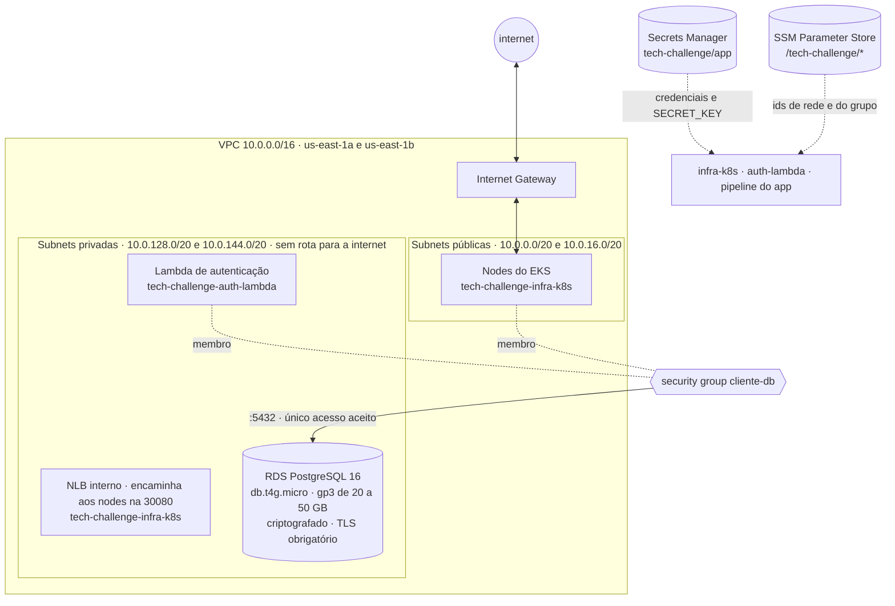

# tech-challenge-infra-db — Rede e Banco de Dados

Terraform que provisiona a **VPC compartilhada** e o **Amazon RDS PostgreSQL** da
oficina mecânica. É o alicerce dos outros três repositórios do Tech Challenge — Fase 03.

> Pós-Tech Software Architecture · FIAP

> **Leia primeiro:** apesar do nome, este repositório é dono da **rede**, não só do
> banco. A VPC, as subnets e o roteamento nascem aqui. O motivo está no
> [ADR-001](#adr-001--a-vpc-pertence-ao-repositório-de-banco), e não é arbitrário.

> **Vai montar tudo do zero?** O roteiro completo, para os quatro repositórios, está em
> [Do zero numa conta nova](#do-zero-numa-conta-nova).

---

## Os quatro repositórios

| Repositório | Responsabilidade |
|---|---|
| **tech-challenge-infra-db** ← você está aqui | VPC, subnets, RDS PostgreSQL, Secrets Manager |
| `tech-challenge-infra-k8s` | Cluster EKS, ECR, API Gateway, role OIDC, New Relic |
| `tech-challenge-auth-lambda` | Function serverless: autentica por CPF e emite o JWT |
| `tech-challenge-app` | API REST da oficina, executando no EKS |

**Ordem de provisionamento:** este repositório primeiro. Sempre.

---

## Documentação

| Documento | Onde está |
|---|---|
| Diagrama de componentes | `tech-challenge-infra-k8s` · README, seção *Arquitetura* |
| Sequência da autenticação por CPF | `tech-challenge-infra-k8s` · README, *Fluxo de uma requisição autenticada* |
| Sequência da abertura de ordem de serviço | `tech-challenge-app` · README, *Abertura de uma ordem de serviço* |
| Modelo de dados: ER, relacionamentos e ajustes | `tech-challenge-app` · `docs/modelo-de-dados.md` |
| RFC-001 · Escolha da nuvem | `tech-challenge-infra-k8s` · `docs/rfc/RFC-001-nuvem.md` |
| RFC-002 · Escolha do banco de dados | `tech-challenge-infra-db` · `docs/rfc/RFC-002-banco-de-dados.md` |
| RFC-003 · Estratégia de autenticação | `tech-challenge-auth-lambda` · `docs/rfc/RFC-003-autenticacao.md` |
| ADR-001 a 004 · rede e banco | `tech-challenge-infra-db` · README |
| ADR-005 a 008, 013 e 014 · cluster, CI e observabilidade | `tech-challenge-infra-k8s` · README |
| ADR-009 a 012 · autenticação | `tech-challenge-auth-lambda` · README |
| ADR-015 e 016 · padrão de comunicação e notificação | `tech-challenge-app` · README |
| Swagger | `<url_api>/docs` na AWS · `http://localhost:8000/docs` localmente |
| Coleção Postman | `tech-challenge-app` · `postman/oficina.postman_collection.json` |
| Ambientes e deploy ativo | só produção, com a dispensa de homologação registrada no README do `tech-challenge-app`; o ambiente AWS é efêmero (ADR-013), e a URL da API sai em `make output`, no `tech-challenge-infra-k8s`, durante uma sessão |


---

## O que é criado



Sem NAT Gateway, uma economia de ~US$ 32/mês (ADR-002).

Além disso: **Secrets Manager** com as credenciais, e **SSM Parameter Store** com o
contrato de integração.

---

## Decisões arquiteturais

### ADR-001 · A VPC pertence ao repositório de banco

**Contexto.** Dois repositórios de infraestrutura precisam da mesma rede. Um deles tem
que ser o dono; o outro consome.

**Decisão.** A VPC pertence a este repositório.

**Motivo — ciclo de vida.** O cluster EKS é deliberadamente efêmero: sobe para trabalhar
e é destruído logo depois, porque o control plane custa US$ 0,10/hora estejam os pods
rodando ou não. O banco, ao contrário, guarda dados e permanece.

Se a VPC pertencesse ao `infra-k8s`, todo `terraform destroy` do cluster tentaria
destruir a rede onde o RDS vive, e falharia com `DependencyViolation` — deixando o
estado pela metade. **O dono da rede tem que ser o recurso de vida mais longa.**

O custo confirma: VPC, subnets, internet gateway e tabelas de rota são gratuitos.
Não há penalidade em mantê-los de pé.

**Alternativa considerada.** Dar a VPC ao `infra-k8s`, já que o EKS é quem tem as
exigências de rede mais complexas — tags específicas nas subnets, mínimo de duas AZs,
CIDR generoso porque o CNI da AWS atribui um IP da VPC a *cada pod*. Rejeitada pelo
problema de ciclo de vida acima. As exigências do EKS foram atendidas aqui mesmo:
as tags `kubernetes.io/role/elb` e `kubernetes.io/role/internal-elb` já estão nas
subnets, e o `/16` dá folga para o autoscaling.

**Consequência.** O nome do repositório subestima o escopo. Daí o aviso no topo.

---

### ADR-002 · Sem NAT Gateway

**Contexto.** O padrão de mercado coloca os nodes do cluster em subnets privadas, com
um NAT Gateway dando saída para a internet.

**Decisão.** Não há NAT Gateway. Os nodes do EKS ficam em subnets **públicas**.

**Motivo.** O NAT custa ~US$ 0,045/hora — cerca de **US$ 32/mês, ininterruptos**. Isso é
mais que todo o resto da infraestrutura somada, num projeto acadêmico com orçamento
próximo de zero.

**Consequência assumida.** Os nodes recebem IP público. A mitigação é que a exposição
real fica controlada pelos security groups e pelo fato de a API ser publicada apenas
através do API Gateway. O RDS continua em subnet privada, sem rota para a internet —
o dado, que é o que importa proteger, permanece isolado.

**Em produção de verdade:** NAT Gateway (ou VPC Endpoints) e nodes privados, sem discussão.

---

### ADR-003 · Integração por SSM Parameter Store

**Contexto.** O `infra-k8s` e o `auth-lambda` precisam descobrir o ID da VPC, as subnets
e o endereço do banco.

**Decisão.** Este repositório publica identificadores em `/tech-challenge/*` no SSM
Parameter Store. Os demais leem por `data "aws_ssm_parameter"`.

**Motivo.** A alternativa natural seria `terraform_remote_state`, mas ela obrigaria os
outros repositórios a ter permissão de leitura sobre o **state inteiro** deste — e o
state contém a senha do banco em texto claro. Com o SSM, cada valor é publicado
deliberadamente, e nenhum deles é sigiloso: são apenas identificadores.

**Consequência.** Os parâmetros abaixo são **API pública**. Alterar ou remover um deles
quebra os outros repositórios.

| Parâmetro | Conteúdo |
|---|---|
| `/tech-challenge/network/vpc_id` | ID da VPC |
| `/tech-challenge/network/cidr` | CIDR da VPC |
| `/tech-challenge/network/subnet_ids_publicas` | IDs separados por vírgula |
| `/tech-challenge/network/subnet_ids_privadas` | IDs separados por vírgula |
| `/tech-challenge/network/sg_cliente_db_id` | Security group de acesso ao banco |
| `/tech-challenge/database/secret_nome` | Nome do segredo |

---

### ADR-004 · Security group invertido para quebrar a dependência circular

**Contexto.** O banco precisa liberar a porta 5432 para o cluster — mas o cluster é
criado depois, em outro repositório. Referenciar o security group dele aqui seria
impossível.

**Decisão.** Este repositório cria um security group vazio, `tech-challenge-cliente-db`.
O security group do RDS libera 5432 **para quem pertencer a esse grupo**. Cluster e
Lambda apenas se anexam a ele.

**Consequência.** Nenhum dos lados precisa conhecer o ID do outro no momento do apply,
e a autorização continua explícita — não existe regra `0.0.0.0/0` em lugar nenhum.

---

## Por que PostgreSQL relacional

O domínio é transacional e relacional. Quando a OS entra em execução, a baixa das peças e a
mudança de status acontecem juntas, com bloqueio de linha para que duas OS não consumam a mesma
peça e com integridade referencial entre cliente, veículo, OS e itens.

A comparação com MySQL, Aurora, DynamoDB e DocumentDB, e as consequências aceitas, estão na
[RFC-002](docs/rfc/RFC-002-banco-de-dados.md). O diagrama ER e os ajustes no modelo relacional ficam
no `tech-challenge-app`, em `docs/modelo-de-dados.md`.

---

## Do zero numa conta nova

Roteiro completo para montar o sistema inteiro — os quatro repositórios — numa conta AWS e
num GitHub que não são os do autor. Nenhum passo usa o console da AWS.

### O que você precisa

| Ferramenta | Versão | Para quê |
|---|---|---|
| AWS CLI | 2.x | credenciais e bootstrap |
| Terraform | ≥ 1.10 | infraestrutura — o bloqueio nativo do S3 exige 1.10 |
| GitHub CLI (`gh`) | recente, autenticado | variáveis e secrets dos repositórios |
| kubectl | até uma versão menor de distância do cluster | operar o cluster |
| Python | 3.12 | empacotar a Lambda e rodar os testes |
| Docker | recente | rodar a API localmente — opcional |

E ainda:

- **Os quatro repositórios no seu GitHub, com estes nomes:** `tech-challenge-app`,
  `tech-challenge-infra-db`, `tech-challenge-infra-k8s` e `tech-challenge-auth-lambda`.
  Os scripts descobrem o dono pelo remote `origin` de cada clone.
- **Uma conta AWS** e um perfil do AWS CLI para ela.
- **Uma conta no New Relic**, do plano gratuito — opcional. A licença (`INGEST - LICENSE`) liga
  o agente e a coleta do cluster; a User key (`NRAK-...`) e o ID da conta criam dashboard,
  alertas e monitor de uptime. A User key e o ID da conta ficam em **API keys**; a licença sai
  pela API no passo 3, porque essa tela pode mostrar só o ID dela.

### 0 · Aponte para a conta certa

```bash
export AWS_PROFILE=seu-perfil     # todos os make exigem isso
aws sts get-caller-identity       # confira o número da conta antes de seguir
gh auth login                     # se ainda não estiver autenticado
```

Os `make` se recusam a rodar sem `AWS_PROFILE` (ou credenciais no ambiente) e sempre mostram
a conta antes de agir. É proposital: evita provisionar na conta errada.

### 1 · Estado remoto — neste repositório

```bash
make bootstrap    # cria o bucket tech-challenge-tfstate-<sua-conta>; pode repetir sem medo
```

### 2 · Rede e banco — neste repositório

```bash
make apply        # ~10 min; revise o plano antes de confirmar
```

### 3 · Cluster e gateway — no `tech-challenge-infra-k8s`

```bash
export NEW_RELIC_API_KEY=NRAK-...   # opcional: dashboard, alertas e monitor
export NEW_RELIC_ACCOUNT_ID=...     # junto com a User key
```

A licença, que liga os agentes, sai pela API usando a User key. Para conta na região EU, troque o
endereço por `api.eu.newrelic.com` e exporte também `TF_VAR_newrelic_regiao=EU`.

```bash
export NEW_RELIC_LICENSE_KEY=$(curl -s https://api.newrelic.com/graphql \
  -H "API-Key: $NEW_RELIC_API_KEY" -H 'Content-Type: application/json' \
  -d "{\"query\":\"{ actor { apiAccess { keySearch(query: {types: INGEST, scope: {accountIds: [$NEW_RELIC_ACCOUNT_ID]}}) { keys { ... on ApiAccessIngestKey { key ingestType } } } } } }\"}" \
  | python3 -c 'import json, sys
d = json.load(sys.stdin)
chaves = ((d.get("data") or {}).get("actor") or {}).get("apiAccess", {}).get("keySearch", {}).get("keys") or []
licenca = next((k["key"] for k in chaves if k.get("ingestType") == "LICENSE" and k.get("key")), "")
print(licenca) if licenca else sys.exit("New Relic recusou a chave: " + str(d.get("errors")))')
echo "licença: ${#NEW_RELIC_LICENSE_KEY} caracteres"   # esperado: 40

make github-segredos   # grava AWS_ROLE_ARN e as chaves do New Relic nos repositórios
make up                # ~20 min · a cobrança por hora começa aqui
```

Mantenha as variáveis do New Relic exportadas até o `make down`: sem a User key, o Terraform
não consegue apagar o dashboard e os alertas, e o `down` recusa rodar.

Ao terminar, o `make up` liga `AMBIENTE_ATIVO` nos quatro repositórios.

### 4 · Lambda e API — pelos pipelines

```bash
make implantar    # ainda no infra-k8s: aciona os pipelines da Lambda e da API
make output       # quando os dois terminarem: url_api e url_swagger
```

Acompanhe na aba *Actions* de cada repositório.

### 5 · Exercitar

1. Abra o `url_swagger`.
2. Autentique como funcionário em `POST /auth/token` — usuário `admin`, senha em
   `make segredo` neste repositório (campo `ADMIN_PASSWORD`).
3. Cadastre um cliente e abra uma ordem de serviço para ele.
4. Autentique esse cliente pelo CPF em `POST /auth/cpf` e use o token nas rotas de cliente.
5. Com a User key configurada, abra o dashboard **Tech Challenge · Oficina** no New Relic.

### 6 · Derrubar tudo — nesta ordem

| Onde | Comando | Por quê |
|---|---|---|
| `tech-challenge-auth-lambda` | `make destroy` | a rota dela vive no gateway do cluster |
| `tech-challenge-infra-k8s` | `make down` | desliga `AMBIENTE_ATIVO` e só então destrói |
| `tech-challenge-infra-db` | `make destroy` | a rede é a última a sair |
| `tech-challenge-infra-db` | `make bootstrap-destroy` | só ao encerrar de vez |

Cada passo recusa rodar fora de ordem e diz o que falta. O `bootstrap-destroy` também recusa
enquanto algum estado ainda gerenciar recursos: apagar o estado antes deixaria infraestrutura
cobrando, sem ninguém capaz de removê-la.

> Se o `destroy` deste repositório falhar em subnet ou security group logo depois de remover
> a Lambda, espere alguns minutos e repita: a AWS libera as interfaces de rede da Lambda com atraso.

---

## Dia a dia

```bash
make conta       # em qual conta os comandos vão atuar
make plan        # o que mudaria
make output      # IDs e endpoints
make segredo     # credenciais geradas, incluindo a senha do admin da API
make custo       # o que este repositório mantém de pé
```

O `destroy` apaga o banco **e os dados**. Com `pular_snapshot_final = false` (o padrão), um
snapshot final é gerado antes — recuperável, mas não automático, e cobra armazenamento enquanto
existir. O `bootstrap-destroy` avisa se sobrar algum.

---

## Custo

| Recurso | Custo |
|---|---|
| RDS db.t4g.micro | ~US$ 0,016/h · ~US$ 12/mês se ininterrupto |
| Armazenamento 20 GB gp3 | ~US$ 2,30/mês |
| Secrets Manager | ~US$ 0,40/mês por segredo |
| VPC, subnets, IGW, rotas | **gratuitos** |
| SSM Parameter Store (Standard) | **gratuito** |
| NAT Gateway | **não existe** — ver ADR-002 |

Contas novas com free tier elegível cobrem 750 h/mês de `db.t4g.micro` nos primeiros
12 meses, o que zera o item principal.

> Configure um **AWS Budget** com alerta em US$ 5 e US$ 20. É gratuito e evita
> a surpresa de um ambiente esquecido no ar.

---

## Segurança

- Senhas **geradas pelo Terraform** (`random_password`), nunca digitadas nem versionadas
- Armazenamento do RDS **criptografado**; TLS obrigatório via `rds.force_ssl`
- Banco **sem acesso público**, em subnet sem rota para a internet
- Acesso liberado apenas a membros do security group `cliente-db` — sem `0.0.0.0/0`
- Estado no S3 **versionado, criptografado e com acesso público bloqueado**
- CI autentica por **OIDC**, sem chave de acesso estática no GitHub

> Recomendação para quem for reproduzir: use um usuário IAM ou o IAM Identity Center, nunca
> as credenciais do usuário root da conta.

---

## CI/CD

| Evento | `AMBIENTE_ATIVO` | O que acontece |
|---|---|---|
| Pull Request | qualquer | `fmt` e `validate`; sem `plan`, porque só a `main` assume a role (ADR-007) |
| push em `main` ou execução manual | `true` | `plan` e `apply` |
| push em `main` ou execução manual | ausente ou `false` | só validação; plan e apply **pulados**, com o motivo no resumo |

**Ambiente efêmero.** O ambiente AWS só existe durante as sessões de trabalho (`make up` e
`make down` no `tech-challenge-infra-k8s`), e a variável de repositório `AMBIENTE_ATIVO` diz ao
pipeline em que estado ele está — ver ADR-013 naquele repositório. **Job pulado não é falha**:
é o comportamento esperado com o ambiente desligado. Já uma falha de autenticação com a
variável em `true` fica vermelha e explica no log as causas prováveis.

A `main` é protegida: mudanças de infraestrutura entram só por Pull Request, com a validação do CI
obrigatória.

| Configuração no repositório | Tipo | Quem grava |
|---|---|---|
| `AWS_ROLE_ARN` | secret | `make github-segredos`, no `tech-challenge-infra-k8s` |
| `AMBIENTE_ATIVO` | variável | `make up` e `make down`, no `tech-challenge-infra-k8s` |

O **primeiro** apply daqui é sempre local: a role que o pipeline assumiria nasce no
`tech-challenge-infra-k8s`, que depende desta rede.

---

## Stack

Terraform 1.10+ · AWS Provider 5.x · Amazon VPC · Amazon RDS PostgreSQL 16 ·
AWS Secrets Manager · AWS Systems Manager Parameter Store · GitHub Actions
